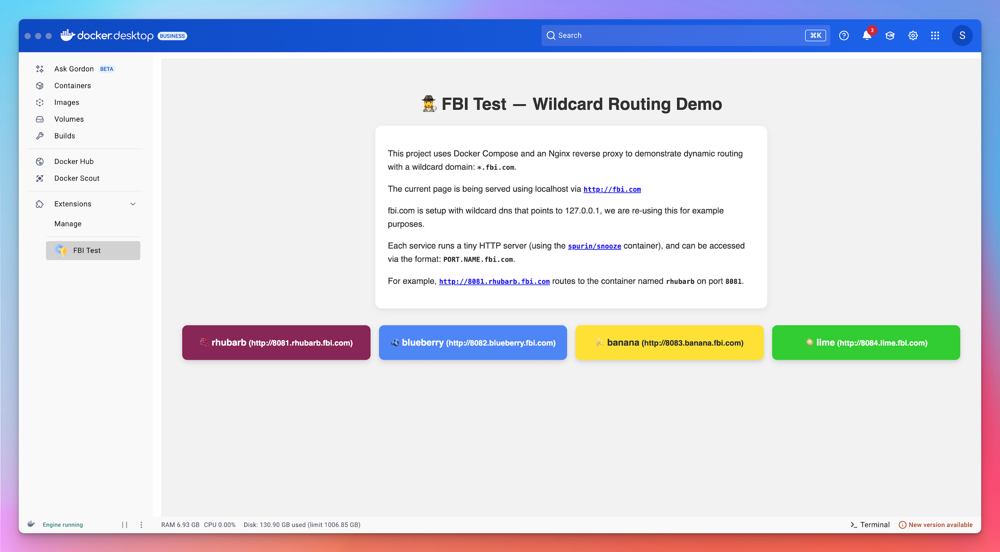

# 📦 FBI Test – Local Wildcard DNS Router with Docker



This project sets up a local reverse proxy system using Docker Compose to allow simplified, dynamic routing via subdomain-based addressing like:

```
http://8081.rhubarb.fbi.com  
http://8082.blueberry.fbi.com
```

> The domain `fbi.com` is assumed to be a wildcard DNS (`*.fbi.com`) to `127.0.0.1` (it is at the time this project was created).

---

## 🌐 How it Works

- A reverse proxy (NGINX) inspects incoming hostnames of the form `PORT.NAME.fbi.com`.
- It extracts the port and service name, then routes requests to the appropriate backend Docker container.
- Each backend runs the ultra-minimal [snooze](https://github.com/spurin/snooze) web server, displaying a custom-colored message and a **Back to Home** button.

---

## 🛠 Build the NGINX Reverse Proxy Image

Before running the stack, you must build the reverse proxy container locally:

```bash
./build-nginx.sh
```

or (Windows CMD) -


```bash
build-nginx.bat
```

This will create a local image named `fbi-nginx` used by the `docker-compose.yaml`.

---

## 🚀 Manual Usage with Docker Compose

You can start, stop, and remove the stack manually using standard Docker Compose commands:

```bash
docker compose up         # Start the services
docker compose down       # Stop the services
docker compose rm -f      # Remove stopped containers
```

---

## 🧩 Docker Desktop Extension

You can install this stack as a Docker Desktop extension for ease of use.

### 🔨 Build & Install

```bash
make build-extension
make install-extension
```

or (Windows CMD) -

```bash
Makefile.bat build-extension
Makefile.bat install-extension
```


The extension will appear in your Docker Desktop under the **FBI Test** tab.

### 🧹 Uninstall

```bash
make uninstall-extension
```

or (Windows CMD) -

```bash
Makefile.bat uninstall-extension
```

---

## 📁 Project Structure

```
.
├── docker-compose.yaml     # Compose file for services
├── nginx/                  # Custom NGINX config and index page
├── default.conf.template   # Nginx config
├── index.nginx.html        # Default page served by nginx
├── nginx.Dockerfile        # Dockerfile for reverse proxy
├── build-nginx.sh          # Helper script to build proxy image
├── build-nginx.bat         # Helper script to build proxy image (Windows CMD)
├── ui/                     # UI served in Docker Desktop extension
│   └── index.html          # Iframe page that opens http://fbi.com
├── Dockerfile              # Extension image
├── metadata.json           # Extension metadata
├── icon.svg                # Docker Desktop icon
├── Makefile                # Extension build/install helpers
├── Makefile.bat            # Extension build/install helpers (Windows CMD)
└── README.md               # This file
```

---

## 🧪 Test URLs

Try opening the main page in your browser [http://fbi.com](http://fbi.com) or access the extension via Docker Desktop.

Click the links in the page or access them manually -

- [http://8081.rhubarb.fbi.com](http://8081.rhubarb.fbi.com)
- [http://8082.blueberry.fbi.com](http://8082.blueberry.fbi.com)
- [http://8083.banana.fbi.com](http://8083.banana.fbi.com)
- [http://8084.lime.fbi.com](http://8084.lime.fbi.com)

Each will display a fruit-themed test page with a link back to the main page (`http://fbi.com`).
